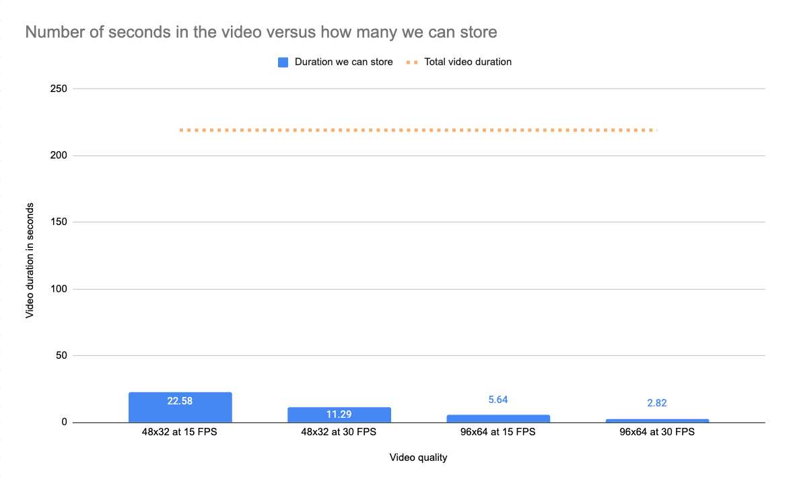

[](https://ko-fi.com/T6T0DOOWP)

# Bad Apple!! in XO-CHIP

This is an attempt to bring the well known [Bad Apple!! music
video](https://en.wikipedia.org/wiki/Bad_Apple!!) to XO-CHIP in its entirety,
music and all. It's a collaboration between
[Kouzeru](https://github.com/Kouzeru) and myself for [Octojam
9](https://itch.io/jam/octojam-9/entries).

 * [The entry on Itch.io](https://timendus.itch.io/bad-apple)
 * [Download binaries](https://github.com/Timendus/chip-8-bad-apple/tree/main/bin)
 * Run the program in your browser:
   * [Long runtime version](https://timendus.github.io/chip-8-bad-apple/long-runtime.html)
     (Low resolution, low quality, but longest runtime)
   * [High quality version](https://timendus.github.io/chip-8-bad-apple/high-quality.html)
     (High resolution, high quality, but only a tiny part of it)

## The concept

In recent years the Bad Apple music video has been ported to many retro systems,
becoming one of those Internet phenomena of which you stop asking "can it play
Bad Apple?" and start asking "when will it play Bad Apple?".

For this year's Octojam I set out to make that happen for XO-CHIP, and I asked
Kouzeru to support this project by writing a 1-bit arrangement of the Bad Apple
music for his XO-Tracker, which he did in a stellar way!

But how much can you really fit in XO-CHIP's ~64k of memory? When I'm
hand-writing code it seems like I never come near the limit. Would it be enough
space to store an entire music video?

So this project quickly devolved into the question "can it play **ALL** of Bad
Apple?" and me learning about image and video compression and trying different
techniques to try to achieve an impossible compression ratio while still being
able to decode that mess using CHIP-8 instructions.

Again, many thanks to Kouzeru for making this project possible!

## See also

If you like this, you may also enjoy my other CHIP-8 projects:

  * [3D Viper Maze](https://github.com/Timendus/3d-viper-maze) (XO-CHIP, Octojam
    7) and [3D VIP'r Maze](https://github.com/Timendus/3d-vipr-maze) (original
    CHIP-8)
  * [Alien Inv8sion](https://github.com/Timendus/alien-inv8sion) (XO-CHIP with
    "secret 16-colour mode", Octojam 8)

If you are a CHIP-8 emulator / interpreter developer, you may be interested in
these projects:

  * [CHIP-8 test suite](https://github.com/Timendus/chip8-test-suite) -
    A test suite to find all kinds of issues in your interpreter
  * [CHIP-8 Binary Format](https://github.com/Timendus/chip8-binary-format) -
    An effort to standardise on a file format for CHIP-8 and friends

## Development notes

### Video on CHIP-8?

How much can you really fit in XO-CHIP's ~64k of memory? When I'm hand-writing
code it seems like I never come near the limit. Even when I add lots of four
colour (or even sixteen colour) images, the resolution is so low that there's
generally plenty of space.

But would it be enough to store an entire music video? A quick
back-of-the-napkin calculation did not make me happy:

#### Calculating the odds

An uncompressed image of 48 x 32 pixels (semi-4:3 aspect ratio in `lores` mode)
is 192 bytes. The entire Bad Apple video consists of 6562 frames at 30 FPS. 6562
x 192 = 1259904 bytes, or 1.2 megabyte of data. That's 19 times the memory we
have available.

I made the same calculation for 15 FPS and for `hires` video:


Calculating from the other end, how many seconds of the video can we actually
store without any compression?



So what do we have to aim for with our compression for this to work? The whole
video is 3 minutes and 39 seconds so we have to shoot for a little under 300
bytes per second. Not per frame, per second! To achieve `lores` video at 30 FPS
we need a compression ratio of almost 95%. For 15 FPS `lores` we need "only"
90%.

I couldn't pull off more than around 25% image compression last
year for [3D VIP'r Maze](https://github.com/Timendus/3d-vipr-maze)...

And keep in mind that we also need some storage left for program code and music.
So this was going to be an insanely tight squeeze. This project was pretty much
doomed from the start 😄

#### The sound part

To improve my odds a bit, I asked Kouzeru (who made the XO-tracker last year) if
he would be interested in joining me on this project for the music part. I enjoy
making music, but I'm no hero when it comes to trackers.

In a little over a week, the first teaser video came my way with the first parts
of the Bad Apple song, and it sounded amazing for the platform 🎉 This was a
hopeful sign that if I could get the video compressed well enough, maybe we
could pull off something cool here.

### Looking at the bright side

It's not all doom and gloom. There are a couple of important reasons why this
project may be doable, even though my calculations say otherwise:

1. Some frames are the same as the previous one. In that case we really don't
   need 15 or 30 FPS to give the impression of fluid motion: a variable number
   of frames per second may be more appropriate;
2. Some frames are _almost_ the same as the previous one. In those cases it's
   much "cheaper" to store the changes relative to the last frame;
3. Our compression doesn't have to be lossless, we can have a few messed up
   pixels in some frames;
4. The Bad Apple video is special in the sense that it has large swaths of the
   same colour for much of the time. So this data should lend itself much better
   to my run length encoding scheme than the 3D VIP's Maze images.

So let's start by just run length encoding each frame and see where we're at.

### So many pictures

After a couple of hours of messing with this project, I had my RLE encoder from
3D VIP'r Maze running on the Bad Apple frames, with a new custom decoder. The
old decoder was built for speed, sacrificing space in both the algorithm and the
compressed images. That choice was made to keep the game playable on the Cosmac
VIP, but we don't necessarily need to be fast here. For XO-CHIP we can just
crank up the cycles per frame.

The result looked like this:


As pointed out above, most frames compressed better if I didn't store the
original frame, but rather the changes from the current frame to the previous
frame. By using XOR to find the changes, we can make use of one of the strengths
of CHIP-8: the only difference in the decoder between rendering a full new frame
and rendering the changes relative to the previous frame is wether the decoder
clears the screen before drawing.

To make sure that we always use the smallest version of the frame, the encoder
checks the lengths of the original (uncompressed) bitmap, the run length encoded
version of the original and the run length encoded version of the diff, and
outputs the smallest of the three. I used kept using this concept, of having
different algorithms "compete" with each other and selecting the winner for each
frame, during the entire development process.

As expected, using diffs combined with the unique nature of the video made this
data compress much better than the 3D VIP'r Maze image data. The first part of
the video easily compressed to an over 50% compression rate. Or in other words:
it made the video less than half as small.

But still, at this stage I could only store the video up to frame 1800 of the
6562 total, while leaving us some space for the music. And that at the low frame
rate of 15 frames per second (I thought, but it's even worse, see below 😉).

Now there were roughly three directions we could take this in:
1. Reduce the frame rate even more; or
2. Reduce the image size a lot more; or
3. Start looking into better ways to compress the video!

Obviously there is only one correct answer 😄

### Cleanup already?!

But before we could get into that, a couple of other things needed fixing:

* I had some weird error in the first couple of frames
* The aspect ratio was wrong
* I didn't like the quality of the resize; it lost too much detail
* Scaling all the frames every time I wanted to change something was too slow

I fixed the last three issues in one go by using ImageMagick to pre-scale the
video frames, instead of doing that in my encoder script. This way we have more
fine-grained control over the type of scaling that is done and we can just read
in the smaller images pixel-by-pixel, which is much faster. I decided to go with
48x32 pixels, as that is relatively close to a 4:3 ratio, a multiple of eight
and can be centered on the screen. To really keep the aspect ratio correct, I
cropped two pixels off the top and bottom of the image.

An added benefit of losing 16 horizontal pixels is that we're also storing less
data than before. So now we can cram images up to frame 2200 in roughly the same
space!

But on the downside, when hunting for my bug (the first issue) I discovered that
I made a little mistake in the code that allows an image to be shown for
multiple frames. I was really only playing (and encoding) 7,5FPS, not 15. That
explains why my calculations were a bit off and also why the video seemed a bit
choppy. Fixing that to be back at a steady 15FPS of course meant that we did one
step forward and two steps back.

It's not as big of a deal as it may seem though, since a higher FPS rate
actually compresses better. Because the difference between successive images is
actually smaller. You'd expect that we could only fit the video in until frame
1100 at the correct 15FPS now (since that's half of 2200), but I was getting
somewhere close to 1500. Still, this was an unfortunate step back.

Other than that, the actual bug turned out to just be an issue with the original
frame images that I was using. Somehow a duplicate of frame 88 ended up in the
file of frame 61. So be warned when downloading an archive from a random
stranger on the internet that it may not always be 100% perfect 😉 I duplicated
frame 62 into frame 61 and called it a day. I don't notice one double frame,
especially at half the frame rate.

The end result after all of this cleanup:


I also tried to tell ImageMagick to apply some dithering instead of just simply
thresholding the images to bring it back to two colours. For some individual
frames, this looks much better. But in motion it looked a bit messy, with
"frayed" edges, and it compressed worse. See for yourself:


### Some tunes 🎶

To get a better understanding of the amount of space I needed to reserve for the
music, I added the standalone player from Kouzeru's excellent XO-Tracker to the
project, together with one of his songs from last year. I tried to be fairly
picky, throwing out anything that I thought wasn't strictly necessary, to leave
as much space as possible for video frames.

Although it's a bit of a mindfuck to see the Bad Apple video but hear an
unrelated song, it's nice to see all the bits and pieces come together. The
whole thing now needs to run at "Ludicrous Speed" in Octo, but that's okay, it's
not trying to be subtle 😄

All in all, this was a fairly simple and painless part of this project! Huge
kudos to Kouzeru for making this drop-in music player!

### Ready, set, go!

Alright, time to get to squeezing bytes!

This was the current state of affairs, when it comes to what lives where in
memory and how big everything is:

|  Address space  |  Size | Type | Contents                |
|-----------------|-------|------|-------------------------|
| `$0000 - $0200` |   512 |  --  | (_Interpreter code_)    |
| `$0200 - $02B3` |   179 | Code | Main loop               |
| `$02B3 - $04AA` |   503 | Code | XO-Tracker              |
| `$04AA - $050E` |   100 | Code | Image decoder           |
| `$050E - $0CCA` |  1980 | Data | Music                   |
| `$0CCA - $FE04` | 61754 | Data | Images                  |
| `$FE04 - $FFFF` |   507 |  --  | Free space              |

So after adding the music we had a little over 60KB (62261 bytes) of space left
to fit the image data. The Bad Apple song could turn out to be a bit larger or a
bit smaller than this song, but we'd cross that bridge when we get there. For
now at least we have a target to aim for!

### Testing ideas

What I had done up to this point was just apply my existing RLE encoder to a
diff of the images. I had three additional ideas to test out:

1. Throwing out frames that change only a pixel or two, merging those into other
   frames that we then show for a longer duration (lossy in the temporal
   domain)
2. Encoding each frame with a bounding box of the part of the screen that needs
   to be updated; that way we don't have to store lots of run lenghts with
   zeroes, and we would probably get smaller diff sizes (lossless)
3. Generating a shared set of 8x8 tiles from the frames and encode each frame as
   a series of pointers to tiles with coordinates of where to put them (lossy in
   the spacial domain)

There are also a couple of ideas for lossless encodings that I was not (yet)
willing to explore. Huffman coding can probably do better than what we have now,
but I didn't really feel like implementing Huffman trees in CHIP-8. Run length
encoding per pixel may also be better than per byte, but that's going to be
pretty slow and annoying.

The first experiment was the easiest to do, and resulted in a very marginal
improvement of a couple of tenths of a percent. Driving up the number of pixels
considered "no change" would give better results, but at the cost of the video
becoming very stuttery. So that seemed like a minor improvement, at best. To
keep the illusion of fluid motion, it may not be a very good idea to accept too
much lossyness in the temporal domain.

The second idea definitely helped out a bit. Having a bounding box made 62% of
the frames store smaller, but each only by a little bit. Implementing this
increased the compression rate for the entire video by about 6%, which is not
bad!

```
Encoding methods used (without bounding box):

  raw input:           23 times
  RLE encoded input:  627 times
  raw diff:             0 times
  RLE encoded diff:  2522 times

  Total size: 321.498 bytes (49% compression rate)
```

```
Encoding methods used (with bounding box):

  raw input:                   9 times
  RLE encoded input:         287 times
  bboxed input:              296 times
  bboxed RLE encoded input:   59 times
  raw diff:                    0 times
  RLE encoded diff:          834 times
  bboxed diff:               294 times
  bboxed RLE encoded diff:  1393 times

  Total size: 281.349 bytes (55.3% compression rate)
```

```
Difference: 40.149 bytes
```

The algorithm adds two bytes to each frame that has a bounding box: one for the
top left and one for the bottom right. I encoded the X coordinate in the three
most significant bits, as a number of bytes, and the Y coordinate in the five
least significant bits, as a number of pixels.

We'll see how useful it's going to be when we get into the third idea, but for
now I'm keeping this in!

### The lossy algorithm

I determined that we don't want loss in the temporal domain, and I thought that
I couldn't push the lossless compression much further without getting
ridiculous, so it was now time to sacrifice some quality in the spacial domain,
in the form of a lossy video codec.

The idea I had was simple enough on the CHIP-8 side: for each frame, we have a
list of sprites to draw. Each entry in the list consists of X and Y coordinates
and the index of the sprite to draw in some shared dictionary of sprites. So in
our decoder, we just do something like:

```octo
  # i points to an entry in the list
  load v2
  i := dictionary
  i += v2  i += v2  i += v2  i += v2  # Add 8 * v2 to i to get pointer to sprite
  i += v2  i += v2  i += v2  i += v2
  sprite v0 v1 8
```

This assumes we have a dictionary of max 256 entries and we use an entire byte
per dimension to store our X and Y coordinate, which may not be the best
assumptions, but this illustrates the concept well. Simple, fast and probably
quite efficient. You could even paste multiple sprites over each other to get
more complicated patterns.

Now the trick that makes this lossy is that we don't try to have every possible
sprite in our dictionary, but we filter the list based on some criteria to come
to a subset that is "close enough" to draw an approximation of the frames with.
And herein lies the hard part.

After writing a couple of different "distance between two sprites" algorithms to
try to generate a dictionary of sprites that differ as much as possible, and
then find the closest match to a sprite in the dictionary when encoding, I had
something that clearly kinda worked.

But... I didn't like the lossy effect at all:


It generated so much noise that the video was a mess. Increasing the number of
sprites in the global dictionary clearly would have made the video better, but
because I would have had to use more bits for my sprite indices, and also store
more sprites, the compression would have been much worse. In the video above I
have limited the encoder to do no more than two sprited frames in a row, but
still the effect is way too messy. The compression was pretty nice though: this
version has a compression rate of 79.6%!

Missing a couple of pixels here and there is fine, but missing whole bands and
blobs of pixels quickly makes the image unrecognizable when you have so few
pixels on the screen to begin with.

So after investing a ton of time into this encoder and decoder, I decided that
this was not the way forward.

### The music arrives! 🎹

To cheer me up though, Kouzeru sent me his tracker arrangement of the Bad Apple
song, and it was absolutely amazing! The man is a genius with 1-bit sound 😄

The song was quite a bit larger than the test song I had been using though, so I
lost some more storage space in the process of putting the new song in. But
that's very acceptable given how amazing the song sounds!

### Huffman trees

So having tried all of my three big ideas, I was basically back to square one.
But armed with more knowledge, and a better understanding of what I was looking
for now:

  * Lossy is fine for a couple of pixels in some frames, but no more
  * We needed to squeeze more pixels into fewer bits

So I sat myself down behind my laptop, read up on Huffman compression
(specifically [canonical Huffman
codes](https://en.wikipedia.org/wiki/Canonical_Huffman_code)) and spent a couple
of days understanding and writing Huffman compression and decompression
routines.

Huffman compression is really quite amazing. It works a bit like Morse code
does: characters that are used more frequently are encoded using fewer dots and
dashes, so a minimal number of dots and dashes are required to send a message.
Or in our case: bytes that occur in the data more frequently get encoded in
fewer bits.

To keep the decompression routine in CHIP-8 a little more manageable, I limited
the maximum number of bits to 16. So a single byte can now be represented by
anything between one and 16 bits. If we then choose our representations wisely,
the size of the whole data gets smaller.

After a couple of days of messing around with this, I was happy to see this
stuttery video:


Because decoding Huffman encoded data is a per-bit operation, and we need to
look up the correct value belonging to the binary representation, it is not the
fastest. After doing a little optimization and cranking up the "cycles per
frame" a bit more, it was pretty fluid again.

And the compression was almost as good as the "spriting" method, at a 79.4%
compression rate!

Because I had limited the maximum size per byte to 16 bits, there were some
bytes that could not be represented. But the great thing about the way Huffman
compression works is that those were automatically the bytes that occur in the
data the least. I used my "find the closest match" logic from the "spriting"
method to make sure those bytes would be encoded in a way that was very close to
the original. If you look closely at the animation above you can see some weird
sticky pixels here and there. I made sure that the encoder would find the diff
between the desired output of the current frame and the actual output of the
previous frame, so those tiny errors would be cleaned up in the next frame. This
last fix slightly reduced the effectiveness to 78.5%.

So even though Huffman encoding is usually considered lossless, this made it a
tiny bit lossy, but in a way that you hardly notice, which is awesome. This also
gives us some wiggle room in the future, by tweaking the max number of bits the
algorithm may use between 12 and 16, we can "tweak" the quality of the video to
make it fit the available memory perfectly. This can make a difference of about
1000 to 2000 bytes, and look anywhere from good to kinda reasonable.

### Interlacing

In the introduction I wrote that for `lores` video at 15 FPS we would need a
compression ratio of 90% to make it fit in memory. Now that we also have some
code, the Bad Apple song and the Huffman decoder, we have only slightly less
than 60.000 bytes left for the video frames. A quick calculation tells us that
we now really need a 90.5% compression ratio. And I had only arrived at 78.5%
(and was already pretty happy with that, to be honest!).

Getting from 78.5% to 90.5% sounds like I was pretty close, but it meant that I
still had more than twice as much data as I could fit, and I still had a long
way to go. Which required something more drastic.

So I explored the idea of interlacing the video. Interlacing is a very old
technique from the world of television. They used to alternate between sending
all the even and all the odd lines of the frame, so that they only needed half
the bandwidth. The delay in the phosphor of CRT monitors would then "blend" the
even and odd lines together so the effect was hardly visible, and a higher
perceived framerate was achieved.

I implemented interlacing in my encoder and decoder, and this is the first kinda
crappy version of that:


I didn't really like the visual effect, but I did like the reduction in data that
it gave me. And I couldn't really be very picky at this point. So I just
comforted myself with the thought that XO-CHIP tries to be "historically
plausible", and as such I can't imagine anyone running XO-CHIP on anything other
than a CRT monitor 😄

As I explained before, having a framerate that's twice as slow does not halve
the compressed data because the difference between frames is bigger. The same
goes for interlaced rows. So adding interlacing to my code reduced the objective
efficiency of the compression to 71.2%. But because we only need to store half
as much data, we're effectively at a 85.6% compression ratio. That's a pretty
big net improvement.

Another benefit when combined with my slow Huffman decompression routine is that
we only have to decompress half as much data per frame, doubling the speed of
decompression.

### Refactoring the encoder

I had a couple of additional ideas to explore, but adding in the interlacing
really showed the limits of my current encoding script. To encode the frames in
a format that Octo understands I just used a simple Nodejs script, that was
getting more and more messy. So I decided that it needed a redo.

The new encoder took quite a bit of time to write. But in the end it allowed me
to play with ideas more easily. For example, I was able to quickly build a
version of the video in `hires` at 30 frames per second, without interlacing and
super limited artefacts, just to see how much of the video Huffman and
run-length encoding could squeeze in 64K:


The answer is: just 16 seconds 🙈

But as seen in the graph above, without compression we would expect this to be
2.8 seconds. So although 16 seconds is still kinda sad, it's almost 6 times
better. And that is even without the bounding box trick (because its encoding
isn't compatible with `hires` and I didn't feel like changing it).

### Single bytes

With the new encoder up and running I tried what would happen if instead of
storing frames as a continuous stream of data (even though we know that much of
it is "empty" when operating on the diff between successive frames), I would
instead store it as mutations of individual bytes.

I encoded each byte that needed to change in two bytes: one for the coordinate
of the mutation (again, three most significant bits for X, least significant
five bits for Y) and another one for the value.

The result wasn't bad actually, but the other encodings were either equally good
or better, so this new method was only chosen for less than 3% of the frames. So
in the grand scheme of things this didn't improve much.

Talking about comparing different methods, here's a graph comparing all the
different ways in which I'm encoding the video at this point:


My script encodes each frame using every method, and them selects the smallest
from the bunch. `chosen` is the sum total of the selected encodings. `skip` is
when a frame can be skipped because nothing changes relative to the previous
frame, which is (nearly) "free" for those frames it applies to.

As you can see, `globalHuffman` is kinda just kicking `singleByte`'s ass. Seeing
how this new method wasn't being used much and saved only 79 bytes (most of
which would be lost again by including the decompression routine), I didn't keep
it in.

### Scrolling

While we're looking at graphs, let's see which encoding methods actually get
chosen by the algorithm:


It was pretty obvious that Huffman encoding was winning the competition more
than 95% of the time, and it seemed to me that only methods that worked in
combination with Huffman encoding had any realistic chance of bringing the total
video size down.

So next up I borrowed an idea from the video codec world. Often the difference
between two frames of video is just shifting the image a couple of pixels.
Imaging a panning shot where the camera just moves to the right or to the left:
we basically just need to shift the image, add a new column or two and update a
pixel here and there. Smart real-world codecs make a lot of use of this.

We have SUPER-CHIP and XO-CHIP scrolling instructions at our disposal on the
decoding side of things, so this seemed to me like a match made in heaven.

After writing the scrolling logic into the encoder, I saw that it would indeed
save us around 4000 bytes, which is pretty nice.

But when I started work on the decoder and testing the results, I realised that
the scroll instructions apply to the whole display, while I wasn't using the two
outermost bytes of the display for the video. CHIP-8 doesn't have a way of
clearing those bytes after scrolling some garbage into them. So we would have to
accept that there's just constantly garbage on the display to the right and to
the left of the video.

That doesn't really make the perfectionist in me happy. So this idea too got
scratched, leaving a potential 4000 byte improvement on the table.

### Getting kinda desperate

To be perfectly honest with you, I never expected this project to be quite as
hard as it turned out to be. When I started it I expected to work on this for
roughly the first week of the jam, and then move on to an actual game.

At this point I had been spending much of my spare time (which, admittedly, is
not all THAT much 😉) on this project for the whole month, and even though I
"only" needed to get rid of the last 30.000 bytes or so (almost nothing,
compared to when I started!) I didn't seem to make much progress anymore. To
make matters worse, I only had a day or two left to wrap this thing up before
the Octojam deadline, and I really didn't feel like releasing an incomplete
video!

So once again, it was time for drastic measures 😈

First, I reduced the frame rate from 15 FPS to an awful 10 FPS. This resulted in
a total size that was just 9867 bytes too large(!)

Smelling the finish line, I tried reducing the number of bits that the Huffman
codebook is allowed to use. I could previously shave off 1000 - 2000 bytes with
this trick, but now that the overall size is reduced a lot, this only had an
impact of a couple hundred bytes.

So finally, sort of as a hack, I added an additional encoding step that just
randomly throws away small changes in the diff. Because each frame tries very
hard to reduce the leftover noise that the previous frame didn't clean up, these
random mess-ups get removed over time and basically just introduce semi-random
decoding noise. But noise that's a hell of a lot easier to compress!

This finally brought the total size of the video down to something we can store!
🎉

I played with the parameters to the random diff reduction step and the Huffman
codebook bits until I felt like I found the least bad trade-off. Time to submit
v1.0 of this thing! We can always release an improved version later!

